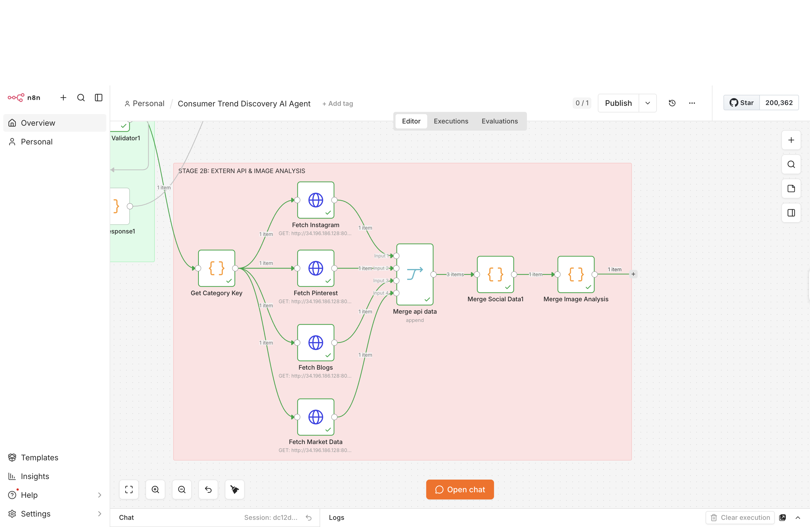
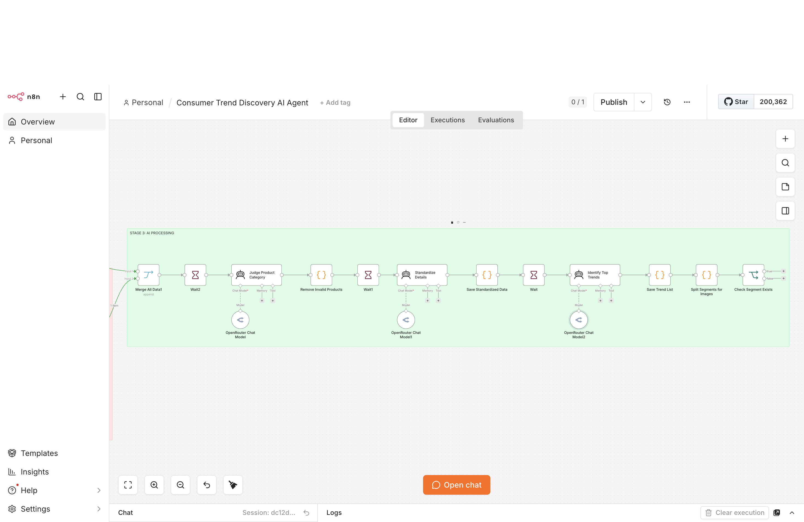
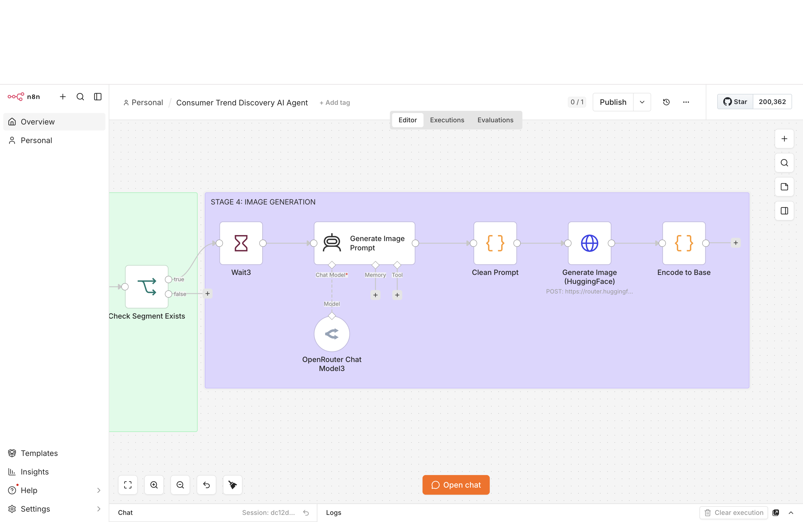
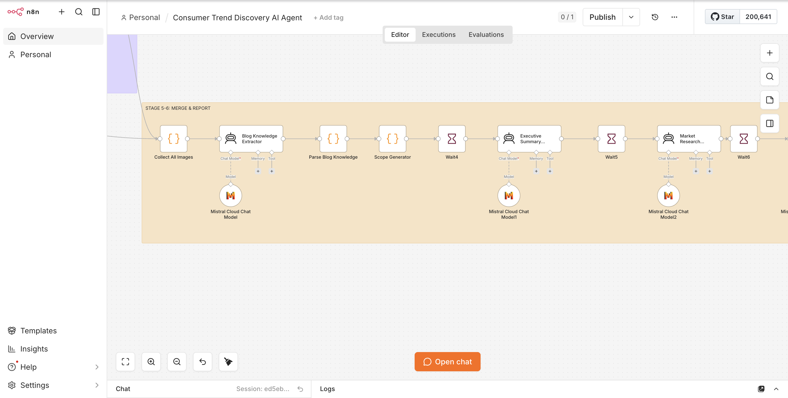
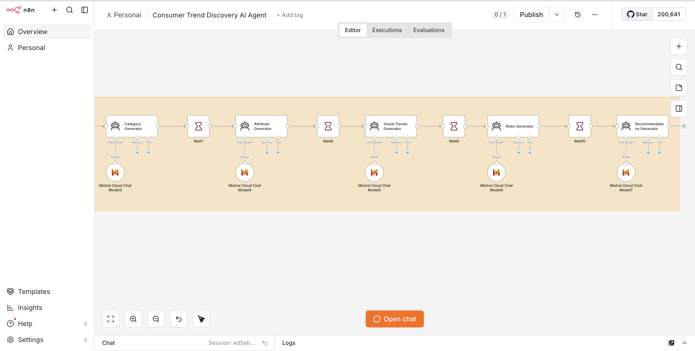
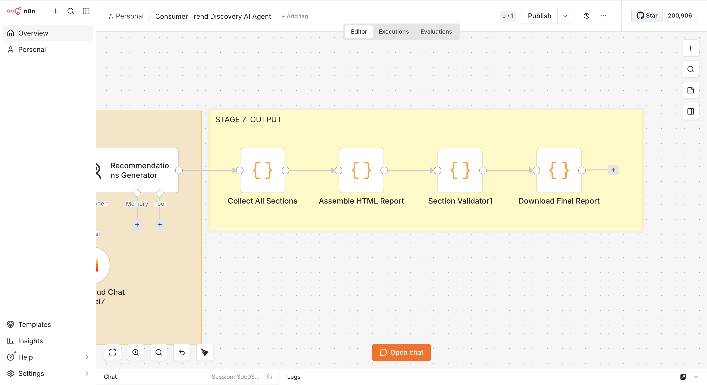

# Consumer Trend Discovery AI Agent

## Summary

An AI-powered workflow built in n8n to explore consumer and product trends
across e-commerce, social media, and market research sources.

The workflow processes product and market data, identifies emerging trends,
and combines the resulting analyses into a structured consumer trend report.

## Technologies

- n8n
- JavaScript
- HTTP Requests / APIs
- JSON Processing
- OpenRouter
- Mistral
- Hugging Face
- AI Workflow Automation

## Workflow

The agent moves through several stages:

1. **Category Input & Validation**  
   Accepts a user-selected product category and validates the input.

2. **Data Collection & Processing**  
   Retrieves product and market information from multiple sources and
   organizes the results into structured data.

3. **AI Analysis**  
   Uses LLM-powered workflow steps to standardize product information and
   identify consumer and product trends.

4. **Visual Trend Analysis**  
   Analyzes visual and social trend information and generates supporting
   visual content.

5. **Trend Synthesis**  
   Combines product, market, social, and visual insights to generate trend
   assessments, risks, and recommendations.

6. **Report Generation**  
   Collects the generated sections, assembles them into an HTML report,
   validates the report structure, and produces the final trend report.

## Example Input

`Area Rug`

## Example Output

The Area Rug analysis generated a structured trend report covering:

- Market and consumer research
- Product attributes and pricing
- Emerging product micro-trends
- Visual and social trends
- Trend risks
- Product recommendations

[View the full Area Rug Trend Report](./area-rug-trend-report.pdf)

## Workflow Screenshots

### Full Workflow

### API & Image Analysis

### AI Processing

### Image Generation

### Trend Analysis & Report Generation

### Final Output

### Final Area Rug Trend Report
[View the full Area Rug Trend Report](./area-rug-trend-report.pdf)
